# 🫡 Hey there, I'm Richard!
...
## Languages, tools & tech
<table>
  <tr>
    <th colspan="5">Currently using</th>
  </tr>
  <tr>
    <td align="center" height="72" width="72">
      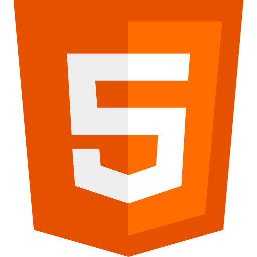
    </td>
    <td align="center" height="72" width="72">
      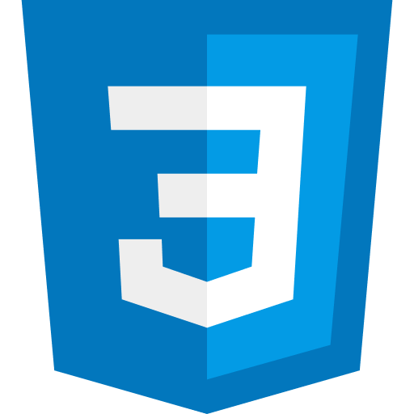
    </td>
    <td align="center" height="72" width="72">
      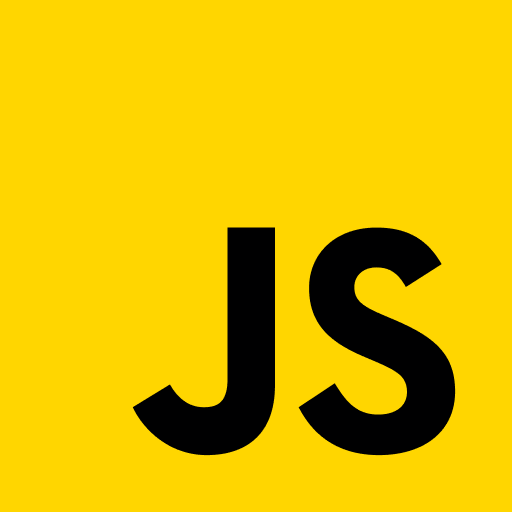
    </td>
    <td align="center" height="72" width="72">
      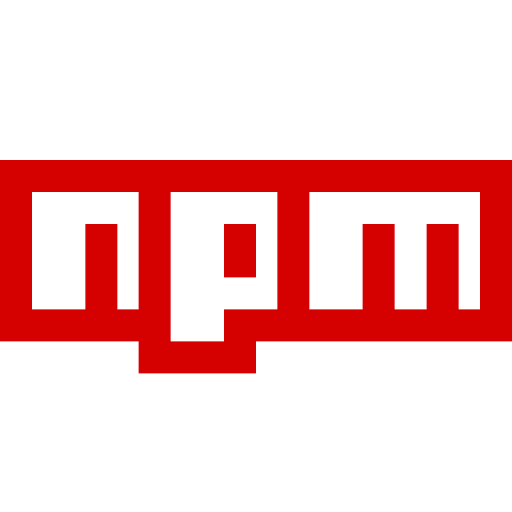
    </td>
    <td align="center" height="72" width="72">
      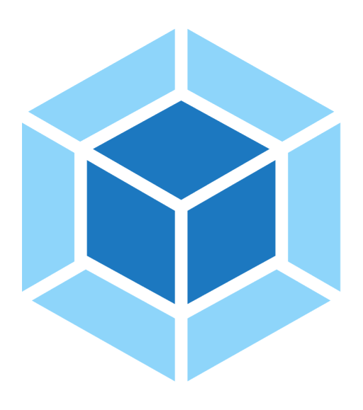
    </td>
  </tr>
  <tr>
    <td align="center" height="72" width="72">
      
    </td>
    <td align="center" height="72" width="72">
      
    </td>
    <td align="center" height="72" width="72">
      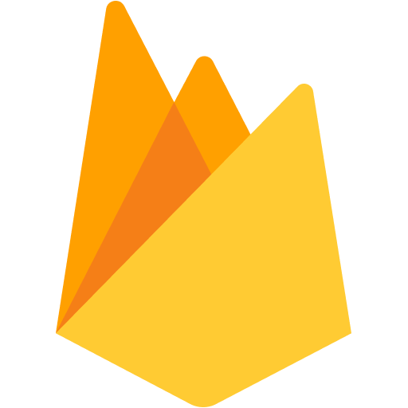
    </td>
    <td align="center" height="72" width="72">
      
    </td>
    <td align="center" height="72" width="72">
      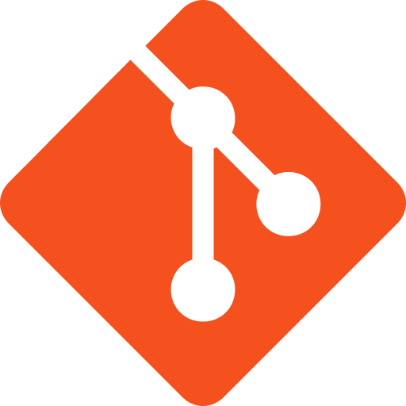
    </td>
  </tr>
</table>
<table>
  <tr>
    <th colspan="4">WIP; learning</th>
  </tr>
  <tr>
    <td align="center" height="72" width="72">
      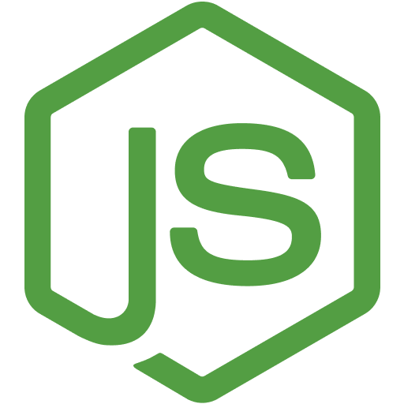
    </td>
    <td align="center" height="72" width="72">
      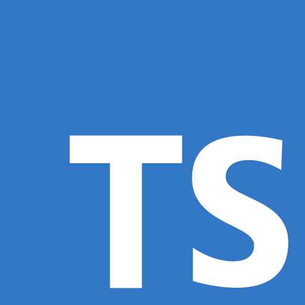
    </td>
    <td align="center" height="72" width="72">
      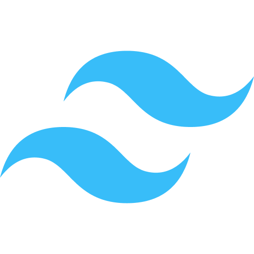
    </td>
    <td align="center" height="72" width="72">
      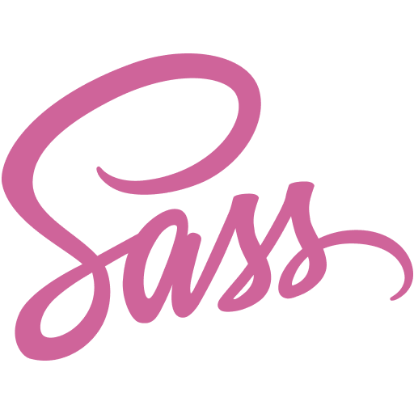
    </td>
  </tr>
</table>

## Learning journey so far ...
### 💬 In progress
* Node.js on [The Odin Project](https://www.theodinproject.com/paths/full-stack-javascript/courses/nodejs)
### 👀 Planning
* Redux, Node.js, MongoDB, GraphQL on [Full Stack Open](https://fullstackopen.com/en/)
### ✅ Completed
* JavaScript & React on [The Odin Project](https://www.theodinproject.com/paths/foundations/courses/foundations)
* Foundations on [The Odin Project](https://www.theodinproject.com/paths/foundations/courses/foundations)
* Responsive Web Design on [FreeCodeCamp](https://www.freecodecamp.org/learn/responsive-web-design/)
